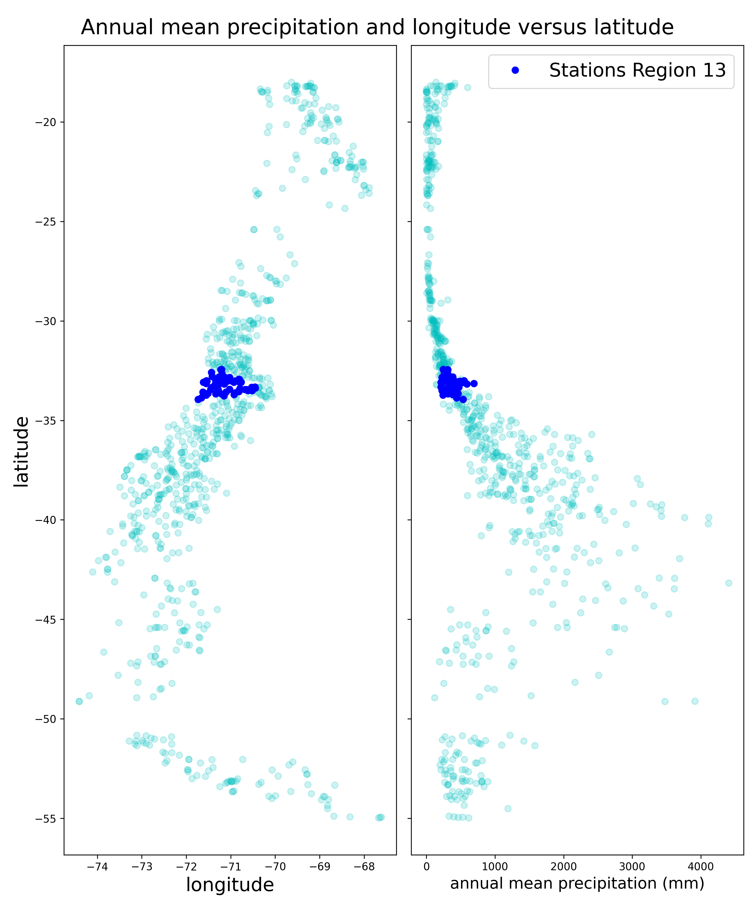

# 2020-drought-in-Chile
Analysis on the current drought that is affecting Chile. [Francisco Munoz, Felipe Kruuse, Cristian Ahumada. Group 17]

# Overview
It is well know that in the past decades a mega drought has been affecting some parts of Chile, affecting severely agriculture and cattle raising business among others. The goal of this project is to check, based on historical data, how relevant it is the current drought that is affecting our country. For that purpose, precipitation data captured from stations located throughout the country will be used to compute cumulated precipitation over the years. Questions we would like to answer are: 
-How does precipitation vary over the years and across the country?
-What are the areas with the greatest reduction in rainfall?
-Have droughts of this magnitude occurred in the past?
-when did the rainfall begin to decrease?

# Data
Our exploration is done using the [daily precipitation dataset](http://www.cr2.cl/datos-de-precipitacion/) generated by The Center for Climate and Resilience Research. This dataset contains 1249 stations from Chile and other countries from South America with daily precipitation records between years 1900-2018. Every daily record corresponds to the cumulated daily precipitation in millimeters, where a missing day is represented by "-9999". The format of the data is a matrix in a text file in the form of a transposed table (data sorted in rows instead of columns) where the first 14 rows contain information such as station code, coordinates or source, and the following rows contain the observed measurements corresponding to each period in time, for all the stations considered. This dataset contains 53.794.430 records of daily precipitation, where some of them could be missing (and thus registered as -9999). This number is compacted in the form of a matrix with 1249 columns and approximately 43.080 rows. We choose this dataset because it collects data from different sources such as DGA (Dirección general del Agua), DMC (Dirección meteorológica de chile) and GHCN (Global Historical Climatology Network) resulting in a very complete dataset.

The dataset does not only contains the main file with the records, it also contains an additional file with information related to each station such as: coordinates, source, institution, date of the start of observations, etc. This information is also present in the first 14 rows of the main file, but here it is present as a normal table that will be helpful during  the data exploration.

Also we use another dataset containing the regional boundary coordinates in UTM system. With this data we group the stations by region of Chile. This dataset is called "Límites de la División Política Administrativa" and can be found on (http://datos.gob.cl/dataset/28286). 

# Methods
## Preprocessing
First of all, we need to preprocess the original data file, transpose the table (so the data are presented by columns) and collapse redundant columns. In particular, after transposing, the table will have one column for each day over the years, resulting in more than 40.000 columns. This number can be collapsed to only 2 columns, one for the date and one for cumulated precipitation. We will also delete all columns that will not be necessary. The resulting table will have the following headers:

| station code | date | cum. precip. |
|--------------|------|--------------|

This data preprocessing is done using apache spark core since the rotation of the matrix could be demanding in memory. With this resulting table we can do a filter for the missing data deleting the rows where "cum. precip == -9999", which is done in the same python spark code [preprocessing.py](https://github.com/cc5212/2020-drought-in-Chile/blob/master/preprocessing.py). The resulting table after this filter has 10.757.927 rows.

## Accumulated precipitation
Having this transformed and cleaned table, we start with the data exploration using apache Pig (since the number of rows can be handled in memory). We computed yearly accumulations when less than 5% of the days are missing. As result, we got a table with 24.082 rows and headers:

| station code | year | cum. precip. |
|--------------|------|--------------|

The code used for this computation can be seen in [estaciones.pig](https://github.com/cc5212/2020-drought-in-Chile/blob/master/estaciones.pig).

## Stations Grouping
As a next step, we have to define geographical zones to group stations and calculate a mean and standard deviation of the yearly cumulated precipitation over each zone. We have two different ways to split the data,as first exploration, we will use the [natural regions](http://countrystudies.us/chile/37.htm) of Chile as the geographical zones. To get the coordinates for each station we will use the additional file present in the original dataset with the information for each station. The pig file ---.pig contains the code used to group the stations by their corresponding geographical zone, generating a table with headers:

| station code | zone name |
|--------------|-----------|

The other way is to split by the regions of the administrative division, to do this, we have to convert the coordinates (Lat-Long) to know to which region belongs each station on UTM coordinates, this has been done by calculating the minimum distance from a station to the regional limits.
The file ---- contains the code use to group the stations by their corresponding region, generating a table with headers:

| station code | region    |
|--------------|-----------|

## Calculating Central Tendency values.
Then, in ---.pig we join these two tables and calculate different values such as mean, standard deviation, maximum and minimum, all of them for the yearly cumulated precipitation for each geographical zone, constructing a table with headers:

| zone name | year | mean | std | max | min |
|-----------|------|------|-----|-----|-----|

## Visualization of results.
Finally, we plot this data to show the behavior of them and perform the corresponding analysis.

# Results

In results, we can see the plots that could show more clearly how is the behaivor of the precipitation over the years.
On this plot we can see the the annual mean precipitaiton  over the latitude and also the longitud over the latitude. The highlighted zone is "Region Metropolitana".

This plot also shows the the annual mean precipitaiton  over the latitude and also the longitud over the latitude, but it shows the natural division.

In this image we can see a distribution fitted by the data extracted from "Region metropolitana".

Then we have the yearly Standarized Precipitation Index (SPI) on "Region Metropolitana" and Central and South Zones.

Región metropolitana:\
 

Central Zone:\

South Zone:\

In all SPI plots, the red zone is the last ten years

# Analysis

Based on the results, we can see that there is more precipitation on the south of Chile and there is little precipitation on the north, this is an intuitive result by climate of the areas of Chile.

Then, we can say that the histogram of yearly accumulated precipitation on the 13th region, seems to fit to a Normal Distribution.

Finally on the SPI plots, we can see there is a downward trend  in the value of SPI on the 13th region and in the central zone. This may showing the drought that is currently affecting the country. In the case of South Zone, this could be less clear, but starting on year 2000, we could also see this downward trend.

# Conclusions

We could say that sometimes the raw data brings difficulties for its preprocessing, beacuse every work has has its own peculiarities. In this case, it's not straightforward to rotate a table and then collapse its columns.
Challeging geographical zone definition. It's not easy to choose the right limits and build the correspondant table. Also political limits do not necessarily conform to geographic or natural limits, so both should be analyzed for a better understanding of the data.

The accumulated yearly precipitation was easy to calculate, because of the preprocessing of the data. But the SPI calculation was difficult to do, because it required very steps of processing.
In general, Apache PIG and Apache Spark, are easy to handle.

# Future Work

We think that could be useful to extend the analysis outside the country to compare if this is an local fenomena or a global one. 
Also could be useful to use The SPI based on the monthly o seasonly accumulated precipitation, to do a deeper analysis. 
Finally, would be better to use more updated data to find out if the trend continues until this year or if it is reversing.

